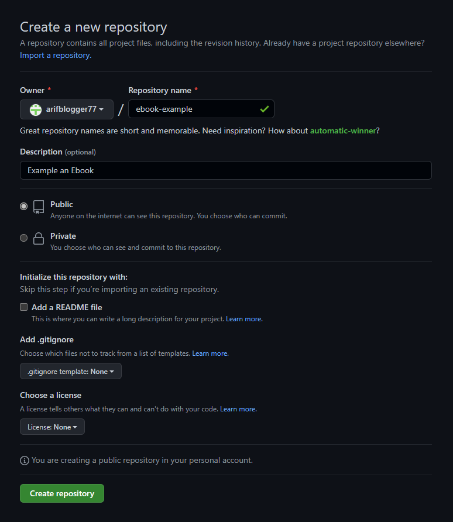
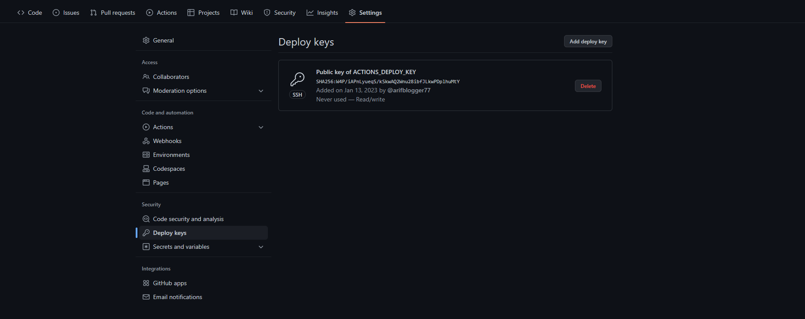
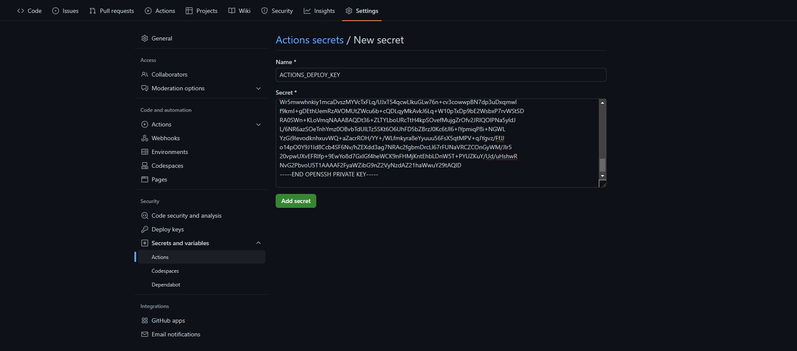
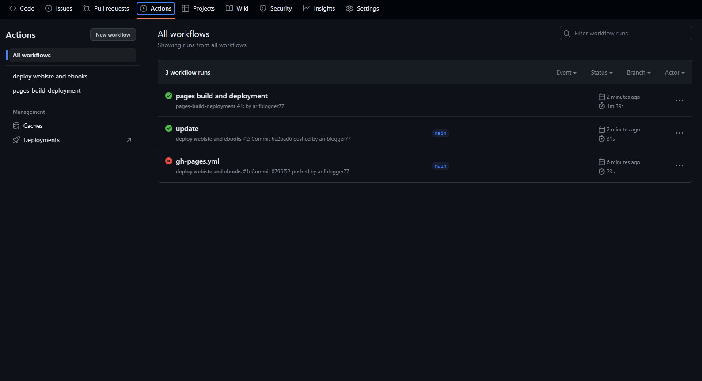
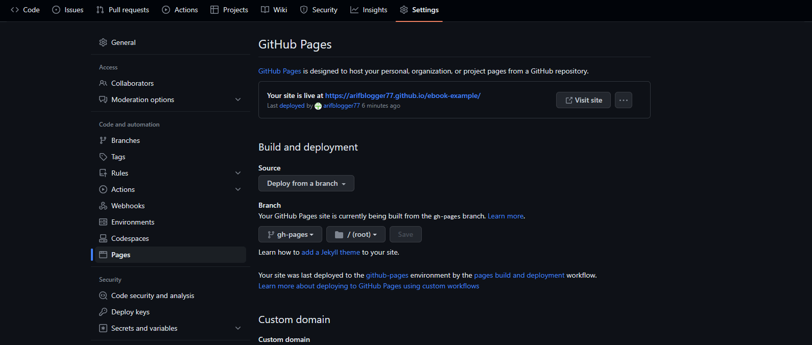
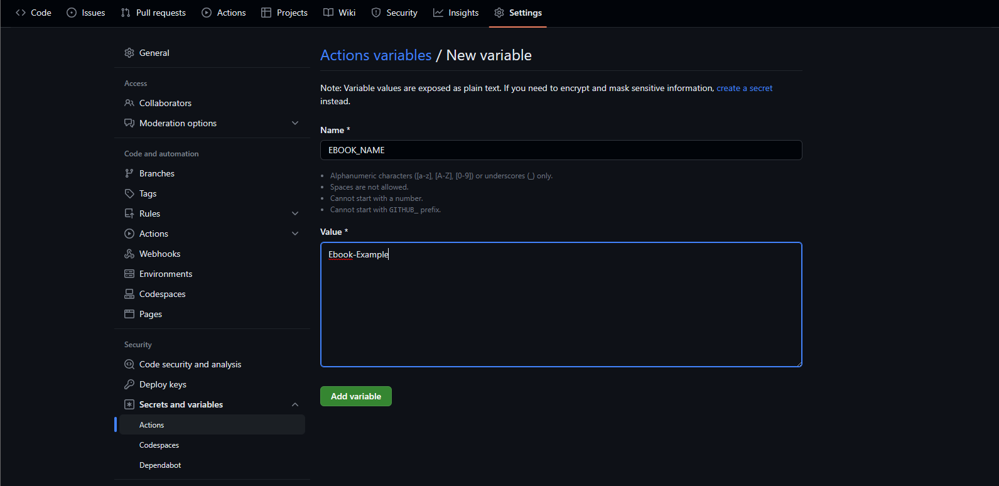
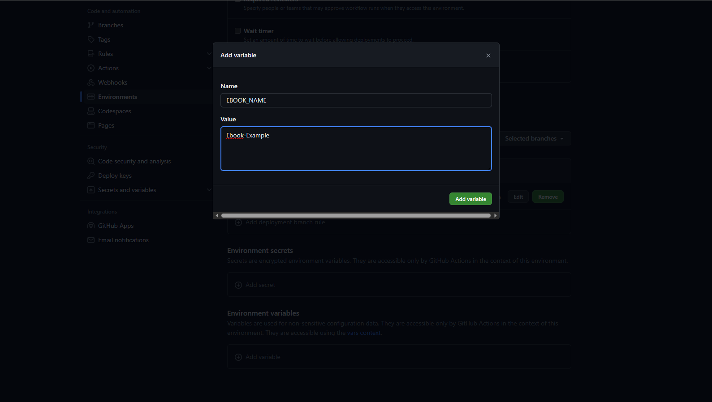
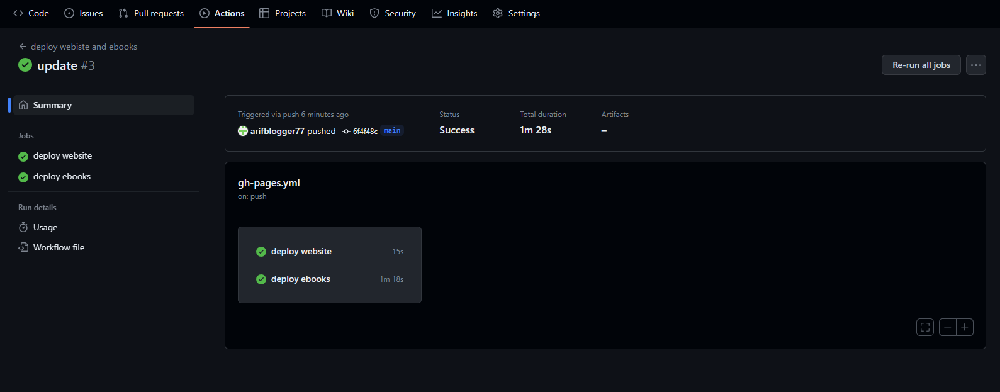

# Serverless Ebook Menggunakan Honkit, Github Pages, Github Action dan Calibre

Tutorial kali ini kita akan membuat sebuah _instance_ ebook menggunakan Github, kemudian di _publish_ ke Github Pages secara otomatis setiap kali kita melakukan _push_ yang di manajemen oleh Github Action, dan melakukan _deploy_ web, serta file (`.pdf`, `.epub`, `.mobi`).

> Ebook ini adalah contohnya!

Setiap kali melakukan _push_, Github Action (CI/CD) akan melakukan _trigger_ (compile website dan membuat ebook), yang kemudian menghasilkan `gh-pages` _branch_ yang aksesnya akan dibuat publik.

---

## 1. Prasyarat
### 1.1. Honkit
Memasang Honkit (pastikan kalian memiliki `nodejs`), untuk langkahnya bisa mengunjungi (https://github.com/honkit/honkit)

### 1.2. Akun Github
Pastikan memiliki akun Github, apabila belum silahkan mendaftar di (https://github.com/signup)

### 1.3. Git Klien
Pastikan memiliki Git klien, apabila belum silahkan mengunduh di (https://git-scm.com/)

---

## 2. Panduan
### 2.1. Membuat Repository Github
Pertama buat repository Github baru di akun Githubmu, bebas mau publik ataupun pribadi. Untuk tutorial ini saya memilih `ebook-example` sebagai nama repository.


### 2.2. Membuat Honkit Project Baru
Kemudian gunakan perintah `honkit` untuk menginisiasi projek baru. Disini saya menamakannya `ebook-example`, sama seperti nama repositorinya.
```bash
mkdir ebook-example
cd ebook-example
npm init --yes
npm install honkit --save-dev # apabila tidak menginstall secara global 
npx honkit init
npx honkit serve
```

Sama seperti gambar di atas, versi web dari ebook telah berjalan.

### 2.3. Menyiapkan SSH Github Deploy Key
Kemudian kita akan menggunakan _plugin_ Github Action dari (https://github.com/peaceiris/actions-gh-pages) agar otomatis _push_ dari repository Github ke `gh-pages` _branch_.

Untuk mencoba skenario tersebut, pertama _generate_ sepasang kunci SSH menggunakan perintah `ssh-keygen` di bawah ini. Kunci tersebut akan digunakan untuk sebagai Github _deploy key_.
> Pastikan sudah melakukan konfigurasi `git config user.email`

> Pastikan projek sudah di `git init`

```bash
ssh-keygen -t rsa -b 4096 -C "$(git config user.email)" -f gh-pages -N ""
# Akan ada 2 file:
#   gh-pages.pub (public key)
#   gh-pages     (private key)
```  
Perintah di atas akan membuat 2 file:
- `gh-pages.pub` file adalah _key publik_
- `gh-pages` file adalah _key pribadi_

Unggah dua file itu ke dalam _repository project keys_ dan _secret_. Untuk melakukannya, buka _repository_, klik **`Settings`**, kemudian ikuti langkah di bawah ini.

> Key Publik


> Key Publik Sukses


> Key Pribadi


> Key Pribadi Sukses

### 2.4. Membuat File Alur Kerja Github CI/CD Untuk Membuat Ebook Versi Web
Sekarang kita akan membuat Github otomatis _deploy_ ebook versi web setiap kali ada _push_. Kita akan mengaplikasikannya pada _push_ yang pertama.
Buat alur kerja baru dengan nama `gh-pages.yml` yang berada di `<yourproject>/.github/workflows`, kemudian tulis konfigurasi seperti di bawah ini:
```yml
# file ./ebook-example/.github/workflows/gh-pages.yml

name: 'deploy webiste and ebooks'

on:
  push:
    branches:
      - main # branch name to trigger deployment

jobs:
  job_deploy_website:
    name: 'deploy website'
    runs-on: ubuntu-latest
    steps:
    - uses: actions/checkout@v3
      with:
        submodules: true  # Fetch Hugo themes (true OR recursive)
        fetch-depth: 0    # Fetch all history for .GitInfo and .Lastmod

    - name: Setup Node
      uses: actions/setup-node@v3
      with:
        node-version: 16

    - name: Installing 
      run: npm install honkit --save-dev

    - name: Build
      run: |
        npx honkit build
        # cp ./CNAME _book/CNAME

    - name: Deploy
      uses: peaceiris/actions-gh-pages@v3
      # If you're changing the branch from main,
      # also change the `main` in `refs/heads/main`
      # below accordingly.
      with:
        deploy_key: ${{ secrets.ACTIONS_DEPLOY_KEY }}
        publish_dir: ./_book

```
Secara garis besar, _workflow_ diatas akan melakukan:
- Trigger _workflow_ setiap kali ada _push_ di _branch_ `main`
- Menginstall `node js`
- Menginstall `honkit`
- Membuild projek
- Menggunakan plugin `peaceiris/actions-gh-pages` untuk _deploy_ ke _branch_ `gh-pages`.

### 2.5. Push Projek Ke Repositori Github
```bash
# Pastikan lokasi di ./ebook-example

# Mengabaikan beberapa direktori
touch .gitignore
echo '_book' >> .gitignore
echo 'node_modules' >> .gitignore
echo 'gh-pages' >> .gitignore
echo 'gh-pages.pub' >> .gitignore

# Inisiasi repositori git
git init
git add .
git commit -m "init"
git branch -M main
git remote add origin https://github.com/arifblogger77/ebook-example.git

# Push
git push -u origin main
```
Kembali ke browser, buka repositori Githubmu, klik `Actions` lihat proses _workflow_ yang berjalan.


Setelah _workflow_ selesai, kemudian buka di browser mengikuti _URL_ berikut.
```bash
# https://<github-username>.github.io/<repo-name>
https://arifblogger77.github.io/ebook-example
```


Jika masih ragu apakah _URL_ tersebut benar, buka menu `Settings` kemudian pilih `Pages` dan klik `Visit site`


### 2.6 Memodifikasi Workflow Agar Menghasilkan File Ebook
Kita akan memodifikasi _workflow_ agar bisa menghasilkan file ebook (`.pdf`, `.epub`, `.mobi`).
Buka kembali _file_ `gh-pages.yml`, kemudian tambahkan _job_ `job_deploy_ebooks`.

Sebelum itu kita perlu melakukan _setting_ `EBOOK_NAME` terlebih dahulu. Buka `Settings` pilih `Secrets and variables` kemudian pilih `Actions`, klik tab `Variables` dan klik `New repository variable`.


Contoh pengisian seperti berikut ini


Selanjutnya pada bagian yang `Environtment variable` klik `Manage environtments`


Klik `github-pages` pada halaman _Environtments_


Lakukan pengisian seperti berikut


```yml
# file ./ebook-example/.github/workflows/gh-pages.yml

name: 'deploy webiste and ebooks'

on:
  push:
    branches:
      - main # branch name to trigger deployment

jobs:
  job_deploy_website:
    # ...

  job_deploy_ebooks:
    name: 'deploy ebooks'
    runs-on: ubuntu-latest
    steps:
    - uses: actions/checkout@v3
      with:
        submodules: true  # Fetch Hugo themes (true OR recursive)
        fetch-depth: 0    # Fetch all history for .GitInfo and .Lastmod

    - name: Setup Node
      uses: actions/setup-node@v3
      with:
        node-version: 16

    - name: Installing 
      run: npm install honkit --save-dev

    - name: Installing Prerequisite 
      run: |
        npm install honkit --save-dev
        sudo apt-get update
        sudo apt-get install -y libgl1-mesa-glx
        sudo apt-get install -y ocl-icd-opencl-dev

    - name: 'Installing calibre'
      run: |
        sudo -v
        wget -nv -O- https://download.calibre-ebook.com/linux-installer.sh | sudo sh /dev/stdin
    
    - name: 'Preparing for ebooks generations'
      run: |
        npx honkit build

    - name: 'Make folder ebooks'
      run: |
        cd _book
        mkdir ebooks
        ls -a
        cd ../

    - name: 'Generating ebook in pdf'
      run: npx honkit pdf ./ ./_book/ebooks/ebook${{ env.EBOOK_NAME }}.pdf
    - name: 'Generating ebook in epub'
      run: npx honkit epub ./ ./_book/ebooks/ebook${{ env.EBOOK_NAME }}.epub
    - name: 'Generating ebook in mobi'
      run: npx honkit mobi ./ ./_book/ebooks/ebook${{ env.EBOOK_NAME }}.mobi
    
    - name: Deploy
      uses: peaceiris/actions-gh-pages@v3
      # If you're changing the branch from main,
      # also change the `main` in `refs/heads/main`
      # below accordingly.
      with:
        deploy_key: ${{ secrets.ACTIONS_DEPLOY_KEY }}
        publish_dir: ./_book
```

`job_deploy_website` akan menghasilkan ebook berbasis website, sedangkan `job_deploy_ebooks` menghasilkan ebook berupa _file_ seperti `.pdf`, `.mobi`, `.epub`. Proses tersebut dibantu oleh __Calibre__.

Baik, selanjutnya kita _push_ lagi.
```bash
git add .
git commit -m "update"
git push origin main
```
Kita lihat kembali di `Actions` sekarang ada job `deploy ebooks`


Hasil dari _file_ ebooknya bisa kita lihat di folder `ebook`


Untuk _direct download_ mengikuti _format URL_ di bawah ini
```bash
https://raw.githubusercontent.com/<yourusername>/<yourrepo>/<yourbranch>/<yourfolder>/<file>.<extension>

https://raw.githubusercontent.com/arifblogger77/ebook-example/gh-pages/ebooks/ebook.pdf
https://raw.githubusercontent.com/arifblogger77/ebook-example/gh-pages/ebooks/ebook.mobi
https://raw.githubusercontent.com/arifblogger77/ebook-example/gh-pages/ebooks/ebook.epub
```

### 2.7 Menambahkan Domain Kustom
Bersifat opsional namun penting, Oke. Mari mencoba menambahkan kustom domain ke _Github Pages_. Silahkan kalian buka _Control Panel_ domain kalian, tambahkan `CNAME` baru yang terhubung ke _Github page domain_ `<github-username>.github.io`.

```
Name: ebook.krearive.com
Value: arifblogger77.github.io
```

Selanjutnya kita buat _file_ bernama `CNAME`
```bash
echo 'ebook.krearive.com' > CNAME
```
_File_ `CNAME` harus di _copy_ ke `_book` agar ikut ke branch `gh-pages`. Caranya cukup _uncomment_ `cp ./CNAME _book/CNAME`
```yml
# file ./ebook-example/.github/workflows/gh-pages.yml

name: 'deploy webiste and ebooks'

on:
  push:
    branches:
      - main # branch name to trigger deployment

jobs:
  job_deploy_website:
    name: 'deploy website'
    runs-on: ubuntu-latest
    steps:
    # ...

    - name: Build
      run: |
        npx honkit build
        cp ./CNAME _book/CNAME

    - name: Deploy
      # ...
```

_Boom_ sekarang _Github Pages_ sudah berubah menjadi domain kustom.


### 2.8 Aktifkan SSL/HTTPS di Github Page
Buka tab `Settings` pilih `Pages` dan centang `Enforce HTTPS`
